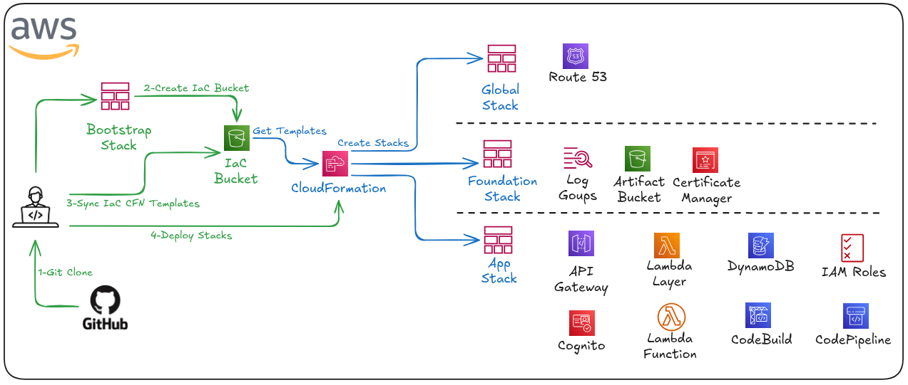
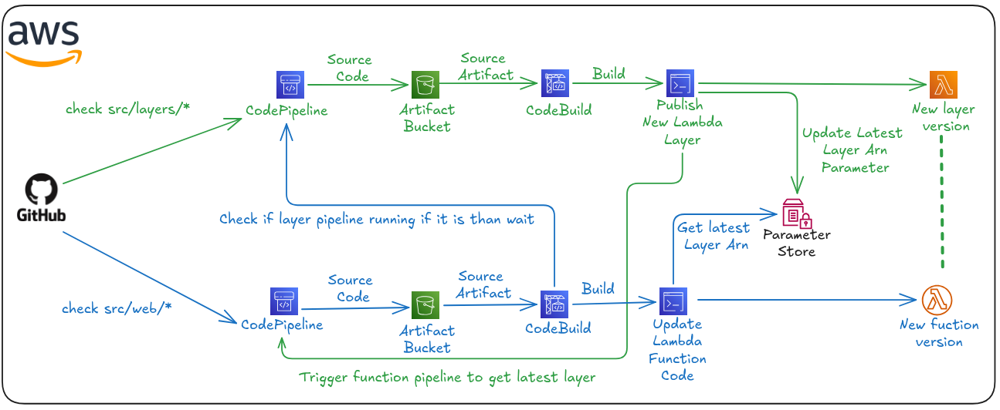
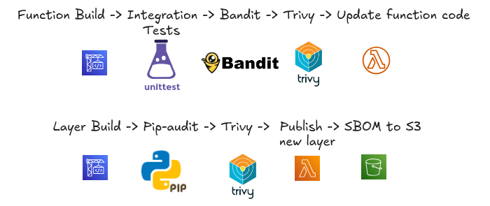
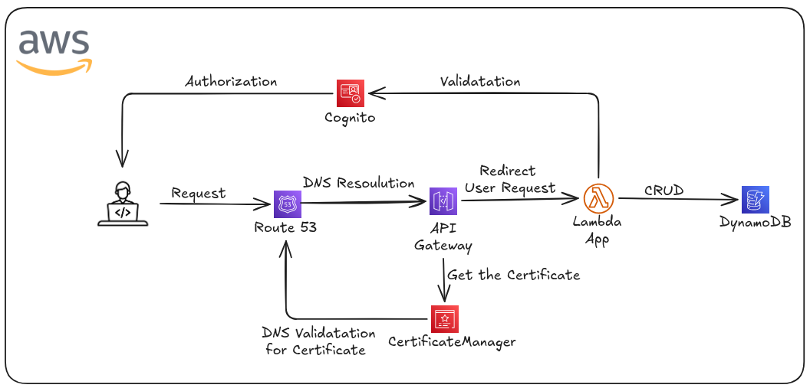

# Ledger App – AWS Serverless Portfolio Project

Ledger App is a minimal transactional ledger service built as a **reference portfolio project** to demonstrate an **end‑to‑end, production‑style AWS Serverless architecture** built entirely with **CloudFormation (nested stacks)** and deployed via **CodePipeline**.
The goal is to showcase how a serverless application can be deployed in **dev/prod environments** using **Lambda**,**Gateway API**,**DynamoDB**,**Cognito**, while keeping infrastructure modular, secure, and reproducible.

The application consists of a small Python web service backed by a NoSQL database. It supports basic CRUD operations and is intentionally kept simple so the infrastructure and pipeline design remain the primary point of interest.


### Project Goals

* Demonstrate **Infrastructure as Code** using CloudFormation
* Implement **CI/CD pipelines** with CodePipeline and CodeBuild
* Support **multiple deployment strategies** (Rolling / Blue‑Green)
* Run workloads on **Amazon Lambda** with Serverless services
* Securely provision and limit access via **Cognito**
* Separate **one‑time database initialization** from application runtime

### Repository Structure

```text
├── infrastructure
│   ├── cicd                            # codebuild files
│   │   └── lambda
│   │       ├── function
│   │       │   └── buildspec.yml
│   │       └── layer
│   │           └── buildspec.yml
│   └── cloudformation                  # cfn templates
│       ├── app
│       │   ├── api_gateway
│       │   │   └── http-api.yaml
│       │   ├── build
│       │   │   ├── iam-role.yaml
│       │   │   ├── project.yaml
│       │   │   └── stack.yaml
│       │   ├── cognito
│       │   │   └── user-pool.yaml
│       │   ├── dynamodb
│       │   │   └── tables.yaml
│       │   ├── lambda
│       │   │   ├── iam-role.yaml
│       │   │   ├── lambda-function.yaml
│       │   │   ├── lambda-layer.yaml
│       │   │   └── stack.yaml
│       │   ├── pipeline
│       │   │   ├── iam-role.yaml
│       │   │   ├── pipeline.yaml
│       │   │   └── stack.yaml
│       │   └── stack.yaml
│       ├── bootstrap
│       │   └── s3-iac.yaml
│       ├── foundation
│       │   ├── acm-certificate.yaml
│       │   ├── logging.yaml
│       │   ├── s3-artifacts.yaml
│       │   └── stack.yaml
│       └── global
│           ├── dns.yaml
│           └── stack.yaml
├── scripts
│   ├── build-layer.sh                   # dummy layer creator for first deployment
│   ├── deploy.sh                        # automated deployment bash script
│   └── destroy.sh                       # automated destroying bash script
└── src                                  # app source code
    ├── layers
    │   └── python
    │       └── requirements.txt
    └── web
        ├── app
        │   ├── auth
        │   │   └── cognito.py
        │   ├── connector.py
        │   ├── extensions.py
        │   ├── __init__.py
        │   ├── main
        │   │   ├── __init__.py
        │   │   ├── login.py
        │   │   └── routes.py
        │   ├── static
        │   │   └── css
        │   │       └── styles.css
        │   ├── templates
        │   │   ├── edit.html
        │   │   ├── form.html
        │   │   └── transactions.html
        ├── config.py
        ├── lambda_function.py
        └── tests                         # app unit tests
            ├── __init__.py
            └── test_app.py
```

### High‑Level Architecture

The infrastructure is organized into **two logical layers**: Foundation and Root.
  

#### 1. Bootstrap Stack

#### 2. Global Stack

#### 3. Foundation Stack

#### 4. App Stack

---

### CI/CD Pipeline Flow


<p align="center">  </p>
---

### App Flow


---

### Summary

This project is designed as a **realistic AWS ECS portfolio**:

* Modular CloudFormation design
* Environment‑aware deployments
* Production‑grade CI/CD patterns
* Clean separation of concerns

It aims to reflect how serverless systems are typically structured in real‑world environments rather than minimal demos.

* Keeps application logic simple and auditable
* Emphasizes reproducibility, security, and clarity

It is not a framework or a product, but a **reference implementation** for serverless delivery pipelines.
