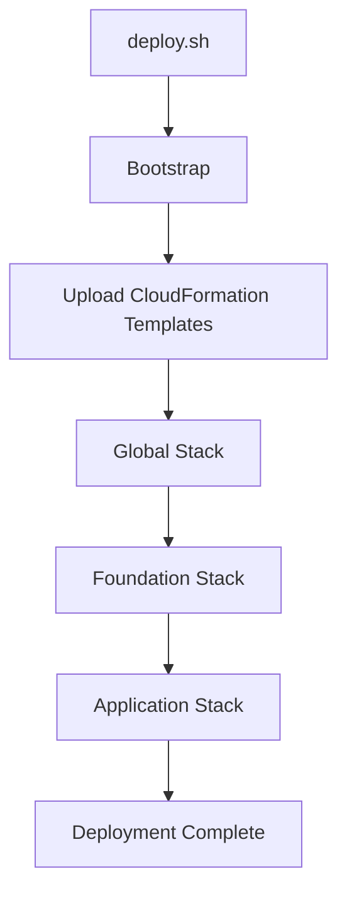

# Ledger App – AWS Serverless

A production-style serverless application deployed entirely on AWS using Infrastructure as Code (CloudFormation). The project demonstrates a complete deployment workflow built around AWS Lambda, API Gateway, Cognito, DynamoDB, Route 53, ACM, CodePipeline, and CodeBuild.

The infrastructure is organized into modular nested CloudFormation stacks and can be provisioned or destroyed using a single deployment script. The project focuses on automation, repeatability, and maintainability, making it suitable as a reference implementation for modern serverless deployments.

## Highlights

- Fully serverless architecture built on AWS managed services
- Modular nested CloudFormation stacks
- One-command deployment and cleanup
- Automated custom domain configuration with Route 53 and ACM
- Secure authentication using Amazon Cognito
- REST API powered by API Gateway and AWS Lambda
- DynamoDB for scalable NoSQL data storage
- CI/CD pipeline using GitHub, CodePipeline and CodeBuild
- Shared Lambda Layer for dependency management
- Parameter Store integration for configuration sharing

## Architecture

The application follows a fully serverless architecture where authentication, API processing, and data persistence are provided entirely by managed AWS services.

The deployment separates shared infrastructure from application-specific resources through multiple CloudFormation stacks. This approach improves maintainability, enables independent updates, and simplifies environment provisioning.

### Architecture Components

| Component | Purpose |
|-----------|---------|
| Route 53 | DNS hosting |
| ACM | SSL certificate management |
| API Gateway | Public REST API |
| Lambda | Business logic |
| Cognito | User authentication |
| DynamoDB | Persistent storage |
| S3 | Deployment artifacts |
| CloudFormation | Infrastructure provisioning |
| CodePipeline | Continuous deployment |
| CodeBuild | Application build process |

## Key Features

### Infrastructure

- Infrastructure as Code using nested CloudFormation stacks
- Modular stack organization
- Automated stack dependency management
- Environment-specific configuration
- Shared resources isolated from application resources

### Deployment

- Single-command deployment
- Partial deployment support
- Dry-run mode
- Automatic template synchronization
- Bootstrap resource provisioning

### Application

- JWT authentication with Amazon Cognito
- REST API using API Gateway
- Stateless Lambda functions
- Shared Lambda Layer
- DynamoDB persistence

### CI/CD

- GitHub integration
- Automated CloudFormation deployments
- Automated Lambda packaging
- Continuous delivery through CodePipeline

  

---

## Deployment Workflow

The entire infrastructure can be provisioned using a single deployment script.

The deployment process is divided into multiple logical stages. Each stage is responsible for provisioning a specific layer of the infrastructure while respecting stack dependencies.

---

### Summary

This project is designed as a **realistic AWS Serverless portfolio**:

* Modular CloudFormation design
* Environment‑aware deployments
* Production‑grade CI/CD patterns
* Clean separation of concerns

It aims to reflect how serverless systems are typically structured in real‑world environments rather than minimal demos.

* Keeps application logic simple and auditable
* Emphasizes reproducibility, security, and clarity

It is not a framework or a product, but a **reference implementation** for serverless delivery pipelines.
